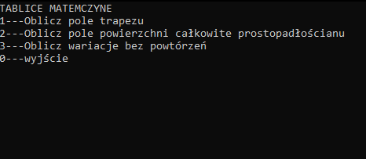
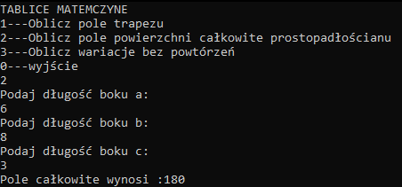
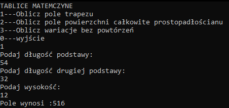
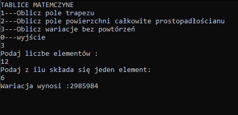

# TabliceMatematyczne

Umożliwiają szybkie wyliczenie najpopularniejszych wzorów matematycznych. 

## General Information

W aplikajci mamy możliwość obliczeń taki jak np:

* Pole trapezu liczone ze wzoru - ((a + b) / 2) * h  
* Pole powierzchni całkowitej ze wzoru - 2 * ((a * b) + (b * c) + (a * c)) 
* Wariacje bez powtórzeń - Math.Pow(n, k)

## Technology 
 Aplikacja napisana w programie:
* Visual Studio 2019

 Język programowania:
* C#
## Screenshots

## Setup
 W celu uruchomienia aplikacji należy pobrać i wypokować plik "TabliceMatematyczne.rar",  
 a następnie uruchmić plik "TabliceMatematyczne.exe"  
 lub uruchomić plik "TabliceMatematyczne.sln" i uruchomienie z poziomu programu Visual Studio 2019.
 
## Usage
 Program został 
 
